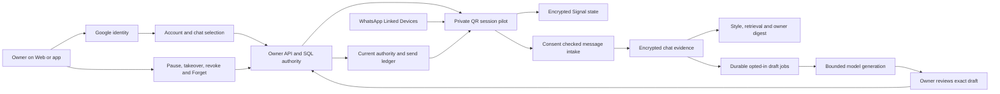

# Milo launch analysis

Milo's target is an owner-controlled communication assistant for busy people:
connect an account, select conversations, let the assistant learn from authorized
examples, receive useful updates, and delegate bounded work without repeatedly
configuring technical settings. One person's account, evidence and reply authority
must remain separate from every other person's.

This review treats 50,000 simultaneous clients as a capacity target. A working
website, a database with 50,000 rows, a mock dispatch, or SDK installation cannot
establish that target. The source and release reports distinguish implementation,
synthetic regression, hosted checks and real-account acceptance.

## Product path and launch segment

The first useful launch segment is owners who need help with selected individual
WhatsApp conversations. Begin with draft review and a compact owner digest. Measure
whether owners accept the drafts, find the source references useful, and trust the
pause/takeover behavior before expanding unattended work. Live groups, broad native
forwarding, other social channels and account-wide autonomous planning are separate
capability gates.

The intended user path is:

1. Sign in with Google and create or restore one workspace.
2. Choose a supported WhatsApp connection. The Business path uses eligible Meta
   assets; the optional linked-device QR pilot uses a private server session service.
3. Scan the short-lived QR in WhatsApp Linked Devices when that pilot is configured,
   or complete the Business account verification.
4. Select specific contacts and choose reading, retention, learning, drafting and
   sending independently. Start with read/draft review; send access requires the
   contact's opt-in and current owner authority.
5. Review the first usable history/examples. An outgoing linked-device message is
   not automatically treated as the owner's writing. The owner confirms examples.
6. Show the first digest and draft with references, missing facts and an exact-text
   review. Show pending connection/configuration clearly instead of an empty
   “caught up” success state.
7. Offer bounded delegated tasks and current controls: pause, takeover, expiry,
   disconnect and Forget. A connection or model answer never silently grants sends.

Google, model and real account settings remain operator responsibilities. Ordinary
users should see connection status and the next useful action, without private
infrastructure variables, tokens or callback configuration in their workflow.

## Reproduced defects and remedies

| Finding | Consequence | Remedy and verification |
| --- | --- | --- |
| Workspace creation is retried after a committed request or failed bootstrap | Duplicate workspaces and confusing setup | Owner-scoped creation-key/payload hashes, unique SQL arbitration, stable client retry key, acknowledgement retained across refresh errors; actual concurrent PostgreSQL arbitration plus lost-response regression |
| Oldest 100 held jobs fill each scheduler tick | Later eligible jobs can remain unprocessed | Persisted fair inspection order for authorized jobs and legacy schedules, preserving authorized due times; more-than-100 held-job regression and clock-tie handling |
| Business history synchronization holds the local control guard during provider HTTP | Owner pause/revocation waits on a slow network operation | Short claim/final-authority transactions ending before HTTP, durable once-only history claim; blocked-provider test verifies responsive owner pause |
| Required Jobs service omits verified automatic-reply worker | A valid automation grant never produces its intended server work | Required tick runs bounded worker lanes with failure isolation and current SQL authority; integration regressions distinguish the supported template lane from generic mock-only actions |
| Signed-in Home reports no urgency before any account is connected | New users mistake an empty workspace for a working assistant | Explicit setup action and honest connection/history states |
| Export-only history appears as a live selected account | Users expect messages to synchronize automatically | Separate history-import wording from a live account connection |
| Native Google configuration cannot recover from a transient fetch failure | User must close/reopen sign-in | Bounded timeout and explicit retry with stale-result protection |
| Message pages use only a timestamp cursor and lack a chat-scoped ordering index | Equal-time messages can disappear between pages; large histories sort excessively | Exact-scoped timestamp/id cursor plus partial read/retention indexes; tenant, equal-time, deleted-anchor and real SQL planner regressions |
| QR and Python DTOs disagree on initial account binding, ingest destination and send authority | First pairing, receive or approved send fails between otherwise healthy services | Exact identity projection and scoped conversation payload; actual private HTTP+PostgreSQL bridge acceptance |
| Disconnect sends the new revoked fence to an actor holding the previous fence | Credential erasure succeeds while the old socket remains open until timeout | Current owner authority can close its older fenced actor without stale credential writes or callbacks; bounded logout then closure |
| Session keys survive but server startup does not restore actors | Users must keep returning after a server restart | Bounded current SQL placement restoration through real authority and exclusive advisory ownership; revoked credentials excluded, lease gaps require contact review |
| Pause denies incoming events as a fatal session error | First incoming message during pause disconnects the phone session | Paused authority supplies no ingest grants, drops content and preserves the socket; sends remain denied |
| SDK console output can contain Signal session material and text URLs trigger previews | Session secrets may reach logs; sending a URL makes an unsolicited fetch | Isolated dependency-console suppression before SDK imports and explicit preview suppression; actual dependency tests |
| Model phase timeouts do not bound a trickling response | One request outlives the durable worker slot and overlapping calls become possible | Cancellable total streamed-request deadline and remaining claim lifetime, bounded body, exact live-slot checks; slow actual HTTP response regression |

The [security review](SECURITY_REVIEW.md) retains prior findings and exact dependency
scan scopes. A regression passes only when it exercises the failed behavior; fixture
success does not establish a provider's real behavior.

## Agent construction and runtime

| Component | Purpose | Current boundary |
| --- | --- | --- |
| Connection/session agent | Establish account ownership, pairing/lease, reconnect and disconnect | Business pilot plus optional private QR service; actual phone/account acceptance required |
| Intake and normalization | Verify source/account/chat identity, deduplicate history/live/echo, enforce grants | Text-only supported lanes; history cannot trigger automatic work |
| Conversation intelligence | Per-chat style statistics, bounded relevant/recent retrieval, source-backed memories | Authorized retained messages and reviewed owner examples; no model fine-tuning or complete-history guarantee |
| Owner companion | Digest, selected-chat questions, missing facts and source references | Owner-only expiring results; no answer grants an action |
| Draft agent | Generate/edit proposed text for one exact destination | Configured model and budgets required; exact owner review before dispatch |
| Background draft agent | Prepare a proposed reply after an authorized fresh inbound message | Separate explicit opt-in, expiring grant, durable once-only job and budget/current-state checks; never sends automatically |
| Verified reply automation | Reply to explicitly granted low-risk business-hours facts/templates | Runs in required Jobs tick, with freshness, consent, expiry and budgets |
| Generic selected-action planner | Typed reaction/quote/forward/task intents and bounded grants | Live general action adapters and evaluated model planning remain incomplete; mock acceptance is labeled |
| Scheduler and dispatcher | Fair durable claims, current-state checks, at-most-once submission and uncertain outcomes | Independent checks immediately before transport; no blind retry after unknown acceptance |
| Privacy/retention worker | Expiry, Forget, auth cleanup and revoked source handling | Managed recovery/key custody still needs acceptance; session auth state has its own cleanup |

The product does not need a marketing label for every internal function. These
components must have one authority model, a visible customer outcome, and evidence
that their required processes are actually running.

## Server-held QR design

The linked-device pilot uses a dedicated private Node service and the pinned actual
Baileys SDK. It stores Signal authentication material encrypted in PostgreSQL with
owner/connector/key identity bound as authenticated encryption data. QR values stay
in short-lived memory, return only through authenticated owner endpoints with
no-store semantics, and render locally without a third-party QR image URL.

Each account has one authoritative session lease/fence. Current Python SQL authority
is checked for session operations, ingestion and exact approved text submission.
Send attempts preallocate and persist a provider message identity before the socket
submission; SDK automatic retry/recent-message resend paths are disabled. Unknown
outcomes remain uncertain, including process restarts. Explicit chat consent gates
retention and ingestion, and source history never authorizes unattended replies.

This is an optional bounded pilot, separate from the official Meta Business
integration. Its SDK is a release candidate, upstream declarations need a bounded
type-check workaround, and the dependency tree includes GPL-3.0 libsignal. The
[QR decision](decisions/0003-personal-qr-sessions.md) records provider support,
dependency/license provenance and operational limits. A loaded SDK does not prove
WhatsApp pairing, primary-phone continuity, completeness of history or receipt
delivery. Those require a consenting real test account.

This diagram describes the pilot components and their authority boundary. It does
not certify a target-scale cell cluster or a live phone connection.

## Capacity model and measured pilot limits

Define capacity separately for authenticated web users, idle linked accounts, live
provider sockets, events per second, active model jobs and outbound submissions.

For 50,000 web clients polling once every 30 seconds, the minimum polling arrival
rate is about 1,667 requests/second. At ten seconds it is 5,000/second. The existing
API global default is about 1,000 ordinary requests/second and the socket-source
budget is about 100/second. Until provider edge source forwarding is verified, one
Web proxy can appear as one backend source. Simply adding replicas does not solve
this shared budget or prove safe distributed account ownership.

The API and Web each reserve four controls within 32 admitted requests, leaving 28
ordinary slots per process. The API's normal SQL pool is five connections plus five
overflow. The new QR pilot is intentionally bounded; a per-account PostgreSQL
session lock is not a suitable 50,000-session design on one database.

The new exploratory HTTP audit used 64 synthetic owners, disposable PostgreSQL,
real Redis limits, the evolving working-tree API and an existing immutable Next
build. Its source hashes/build identity are recorded separately; it is not final
release certification.

| Path | Concurrent users / burst | Attempts | Unexpected failures | p95, ms |
| --- | --- | --- | --- | --- |
| Direct API | 8 | 80 | 0 | 395.170 |
| Direct API | 24 | 240 | 0 | 1,078.344 |
| Web proxy | 8 | 80 | 0 | 292.758 |
| Web proxy | 24 | 240 | 0 | 1,151.170 |
| Direct API | 64-request burst | 127 | 99 explicit 503 | 967.115 |
| Web proxy | 64-request burst | 127 | 99 explicit 503 | 943.336 |

Both burst paths recovered afterwards. Safety checks reported no unsafe successful
response. The fixture occupied 18,776,591 bytes, was capped at 500 MiB and was
dropped. Zero real WhatsApp accounts, Google exchanges or model calls were included.
The 503 rows remain failed availability results. See
[exploratory benchmark evidence](benchmarks/launch-capacity-exploratory-2026-10-07.json)
and the [previous load report](LOAD_TEST_REPORT.md).

A target-scale design needs independently bounded account cells, a distributed
cell ownership protocol, durable encrypted session storage without one long-lived
SQL connection per account, batched event ingestion and per-owner fair queues.
Use authenticated change notifications or long-lived subscriptions with recovery
cursors to reduce polling; keep authority in SQL and never publish customer payloads
to broad channels. Verify signed edge source identity before enabling forwarded
source budgets. Bound API/database pools against the actual database connection
limit across every replica and worker. Benchmark model and provider quotas separately
from CPU/HTTP capacity.

Advance through measured cohorts, including 100, 500, 2,000, 10,000 and 50,000,
with explicit offered rates and no hidden retries. Require zero cross-owner success,
no duplicate external submissions, responsive controls, sustained latency/error
budgets, queue fairness, session restart/reconnect and storage recovery. A synthetic
idle connection test cannot replace real-provider session memory and message tests.
Provisioning paid capacity and running target-scale external-account tests need
the corresponding resources; no such result is inferred from this pilot.

## GTM acceptance and economics

Measure the same funnel in every pilot cohort: sign-in completion, successful account
connection, first authorized chat, first digest, first accepted draft, first verified
delivery and retained weekly use. Count configuration failures, pairing expiry,
reconnects, permission denials and uncertainty separately. Record content-free
operational events; private conversations are not product analytics payloads.

Activation means a real owner connects an account and receives a useful result in
their selected scope. A synthetic demo visit or a QR displayed without pairing is
not activation. Draft acceptance and owner correction are separate from actual
delivery. Test private questions, malicious inbound instructions, missing history,
ambiguous authorship, disconnected accounts and opted-out recipients.

Price from measured support cost, server/session memory, database/storage retention,
model tokens and verified provider charges. Calculate model cost as input tokens
times the exact input rate plus output tokens times the exact output rate, with
per-owner budgets and fair queue limits. Do not publish a flat unlimited plan or
promise 50,000-person service before measuring those costs and limits.

## Launch gates

Before a public paid launch, configure and test real Google website/installed-app
login, scan a real linked-device QR or verify the eligible Business account,
receive authorized text, review actual owner examples, generate a model draft,
send to an opted-in recipient and observe receipts. Exercise pause/takeover,
uncertain delivery, logout, disconnect, credential erasure, Forget and a recovered
server session. Complete installed-device acceptance, provider eligibility/support,
dependency/license review, remaining security remediation, managed backup restore
and the chosen capacity cohort.

The repository and hosted release can be published before these account tests, but
must remain labeled a pilot. The exact release report records which gates actually
ran and which still require account credentials, phone access or infrastructure.
