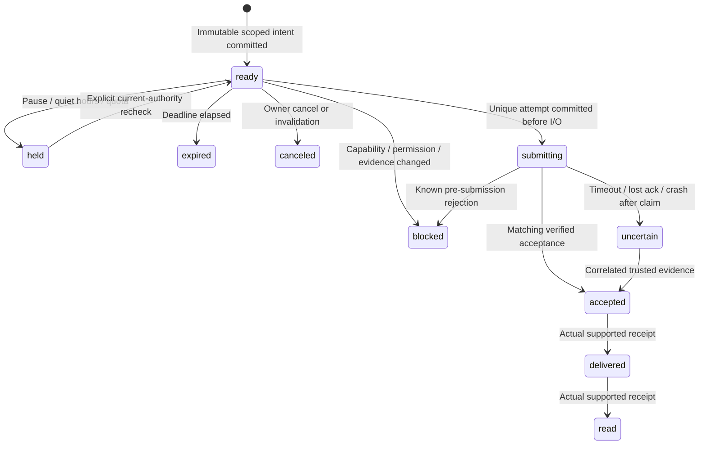

# Reliability and reconciliation

Updated 7 October 2026; exact run dates are recorded in QA. SQL owns scope, consent,
versioned control, durable action
intent, schedules and submission attempts. A model, browser, native app, push event or
queue item cannot create sending authority. Existing backend policy/recovery results are
synthetic unless explicitly identified as actual local infrastructure in
[QA_REPORT.md](QA_REPORT.md). Milo client/session helpers and local browser journeys have
their own recorded checks; no real provider reconciliation is claimed.

## Attempt state machine

The diagram uses public semantic states. Existing legacy draft transport calls its claim
`dispatching` and uses a `SendAttempt`; six-operation transport uses `submitting` and a
`SubmissionAttempt`. These are distinct ledgers with the same no-blind-retry rule.
Cancellation/expiry can prevent a new submission but cannot recall an already-started
external side effect. Delivery/read do not apply to unsupported operations or contact saves.

`OutboundAction` has a workspace/logical-turn uniqueness key; `SubmissionAttempt` has a
unique action ID. Legacy drafts have a unique attempt per draft. Each immutable intent
binds trusted account/chat/recipient, payload/hash, trigger, evidence/revisions, native
source/target, exact forward route and both audiences, control/permission/capability
versions, actor fence, pause generation and expiry. Cross-kind reply/quote/reaction
replanning cannot create a second answer to the same fresh turn; each separately granted
forward destination has its own deduplication identity.

An existing `submitting` six-operation attempt after restart becomes uncertain instead
of obtaining another external call. Repeating a legacy draft dispatch returns its saved
attempt. Timeouts, invalid/mismatched bridge responses and lost response bodies preserve
uncertainty. A public UI must show review/reconciliation rather than immediate Resend.
Uncertain reservations remain counted against budgets until the outcome is safely known.

## Current authority and control

Dispatch re-reads SQL before claim and again immediately before submission. The authenticated
Python–Node bridge validates the immutable envelope/hash and calls current SQL authority;
a prior ticket cannot override changed permissions, route versions, source availability,
context, lease/fence, expiry or pause. SQL locks are not held throughout network I/O.
Process-local submission guards coordinate one process; they do not establish a
distributed account-owner lease or eliminate the network boundary race.

Global Pause is complete only after authoritative server commit/ack. The UI must show
pending during latency and “Pause not confirmed; automation may still be active” offline.
After observed authoritative change, new eligible submissions are blocked and pending
actions are invalidated or held according to their durable intent. An in-flight action
retains its actual result/uncertainty. Resume performs a fresh current-authority check;
it never revives canceled work or blindly releases a stale backlog.

Saved mode, sticky human takeover, workspace pause generation, connector observation
health and action delivery are separate concepts. Closing or signing out of an app does
not pause/unlink a server connector. Fresh trusted human outgoing messages trigger sticky
takeover; live human reactions handle their specific targets. Assistant echoes and
imported history do not become human evidence. Unknown outgoing origin holds dependent
automation and is excluded from voice learning.

## Failure boundaries and evidence

| Boundary / fault | Implemented recovery policy | Existing evidence / open gate |
| --- | --- | --- |
| Before intent transaction commit | No durable action/receipt; no external submission | API/action transaction fixtures |
| After commit, before worker claim | SQL intent survives; only current eligible work can claim | Job/schedule/action fixtures |
| Duplicate request/parallel claim/replanning | Unique intent/attempt returns existing outcome or rejects changed content | Actions/jobs/messaging uniqueness fixtures |
| Control/source/route change before I/O | Final check blocks stale action | `test_actions.py`, `test_jobs.py`, `test_messaging.py`, bridge tests |
| Expired lease/stale fence/unreadable authority | Fail closed for new submission | Lease/fence fixtures; distributed suspended-process trial NOT_RUN |
| After attempt claim / possible provider I/O | Retain uncertainty; do not create second attempt | Action restart and bridge timeout fixtures |
| Provider accepted, response/SQL ack lost | Original provider/action identity must reconcile | Synthetic receipts/echo fixtures; real provider trial BLOCKED_EXTERNAL |
| Receipt arrives before transport returns | Matching stronger receipt wins; states do not regress | Messaging/action receipt fixtures |
| Receipt is foreign, unknown or mismatched | Reject; never assign it to a guessed action | Scope/provider-ID fixture negatives |
| Data removed after network submission | Do not resurrect private data or resend | Messaging/lifecycle fixtures |
| Model timeout/missing usage/quota exhaustion | Conservative admission/reservation; uncertain spend retained; stale work held/expired | Budget/model fixture tests; real bills/limits unverified |
| Temporal registration ack lost | ID-only outbox retries same workflow identity | Outbox fixtures and actual local worker-kill/restart smoke |
| Kafka broker ack / SQL ack gap | At-least-once publication; consumer dedup by outbox event ID | Relay fixtures and actual local broker smoke |
| App offline/background/process killed | Server work independent; client must re-fetch authorized state before action | Browser offline Pause and stale-logout snapshot passed; native helper fences passed; installed lifecycle NOT_RUN |
| Out-of-order push/stale sync cursor | Push is a hint; authorize snapshot/cursor and repair gaps | New native API/client integration NOT_RUN |
| Database/zone loss and backup restore | Apply permission/deletion tombstones before exposure/outbox replay | Production restore/fault gate NOT_RUN |

New full backend runs passed 533 SQLite cases and 533 PostgreSQL cases before the final
contextual catchup follow-up; its focused evidence is recorded separately in QA. The prior
backend increment covered 495 cases. The actual local
Kafka/Temporal smoke recorded one metadata event and exactly one accepted mock send after
worker termination/restart. Those checks establish the stated local behavior; they do not
establish live WhatsApp, distributed lease failover or native hardware recovery.

The client runs passed 62 browser cases and 16 native helper cases. Logout/session
changes fence delayed snapshots and clear the private rendered subtree; native secret
storage operations are serialized and bound to origin/environment. No client automatically
retries an external mutation after offline or uncertain transport. These facts are narrower
than complete installed-device or push reconciliation. Full refresh currently resets
conversation pagination/reading position, and no complete resumable mobile event stream is
implemented.

## Provider reconciliation limits

Trusted receipts require an exact connector and existing provider-message correlation.
Assistant message/reaction echoes are matched to a durable attempt and exact destination/
operation evidence. If a crash lost the provider ID before it was recorded, the current
receipt APIs cannot guess a safe match; the uncertain action stays held for explicit
provider-specific reconciliation. There is no shipped personal WhatsApp session adapter,
native object lookup or production reconciliation operator workflow yet.

Phone takeover starts when the trusted server transport observes the phone event, not when
the human physically presses Send. Observation lag, disconnects and already-started I/O
create a residual race. Measure external observation lag separately from server control
commit and UI display latency; degraded observation must hold dependent Auto. Do not
promise instantaneous recall, exactly-once provider execution or immediate deletion from
an offline device.

## Client/deployment acceptance still required

TEST-R01–R08, TEST-J01–J04 and TEST-N02–N08 require explicit run records. Exercise crash
points before commit, after claim, during I/O and after external acceptance; suspend stale
actors rather than relying only on graceful shutdown. Test web/native concurrent pause,
memory correction, revoke, schedule cancel, reconnect and stale intent; preserve exact
IDs/versions and purge revoked previews on observation. External commands must not replay
automatically from offline local storage.

A public synthetic demo must isolate visitor state and keep external sends disabled. A
Railway process restart, HTTP health check or public URL cannot prove durable production
recovery. Production requires PostgreSQL, safe expand-first migrations, persistent workers,
managed secrets, account-actor draining, canary/rollback, provider-specific reconciliation,
tested backup/tombstone restore and staged resource/fault evidence. See
[DEPLOYMENT_RUNBOOK.md](DEPLOYMENT_RUNBOOK.md) and [LOAD_TEST_REPORT.md](LOAD_TEST_REPORT.md).
