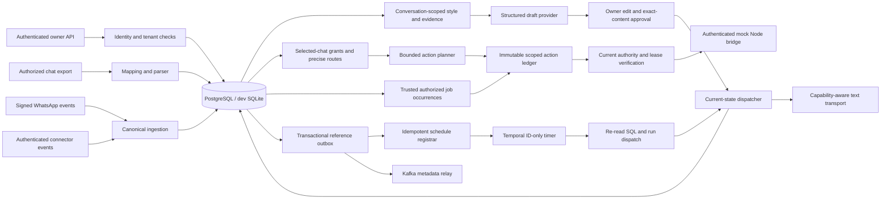

# Milo architecture

SQL is the authoritative record for tenant ownership, conversation permissions, evidence,
draft approvals, automation grants, sharing routes, scheduled intents, connector fences,
and send attempts. A model proposes
content; it cannot access the database or send a message.

The current increment adds Next.js web and Expo/React Native clients over the
same versioned API/contracts. Native secure sessions, device/snapshot recovery, voice and
contact intents must preserve server-derived ownership and current authority. Push and
deep links are navigation hints; neither is permission to execute. Client implementation
and local acceptance have passed recorded checks; installed-device and external-provider claims require
separate evidence in [MOBILE_PARITY_REPORT.md](MOBILE_PARITY_REPORT.md).

The implemented client API increment lives in `assistantui.py`, `mobile_auth.py` and
`mobile_models.py`. It adds bounded readable-page snapshots and protected object resolution,
owner-authored exact unsent drafts, server timezone/DST resolution, optimistic owner edits,
native Google nonce/S256 exchange, hashed rotating application sessions and scoped session
revocation. Device names are encrypted. Native refresh rotates both secrets with a CAS
predicate and preserves the original bounded session deadline. These application sessions
are distinct from WhatsApp account-actor/session credentials.

Web uses a server-configured allowlisted same-origin proxy; native uses a configured HTTPS
API origin and protected device storage. Client private state must be fenced by session
generation and snapshot ordering, with no delayed-response restoration after sign-out or
newer permission snapshots. UI snapshots are bounded SQL projections, not a complete event
stream or proof of provider-history completeness. Push registration, speech provider and
OS-contact execution remain separately unavailable integrations.

The FastAPI application factory is `assistant.main:create_app`. SQLAlchemy models are
under `services/api/assistant`; Alembic schema changes are under `db/migrations`.
SQLite supports a lightweight single-instance development and test workflow. PostgreSQL
is the deployment database and provides the row-lock semantics used for concurrent
workers. The development PostgreSQL image includes pgvector, but this initial retrieval
implementation does not create an embedding index or perform vector search.

History, replay, and unknown-origin traffic do not establish live eligibility. Style
learning selects owner-authored human samples and excludes system, assistant, media,
deleted, and otherwise ineligible messages. Models receive bounded conversation context
and references rather than database credentials or tools.

Every draft captures the permission version, conversation revision/control epoch,
workspace pause generation, and connector fence. Dispatch revalidates those versions,
approval expiry/hash, current permissions, evidence, account capability, and recipient
rules. A unique attempt per draft is committed before calling the provider. Ambiguous
provider outcomes are retained for reconciliation and do not authorize a blind retry.

The CTO handoff extends the same boundary to a typed outbound action ledger: send, quote,
reaction and forwarding payloads must bind exact authority and source/target versions.
General response deduplication is keyed to the logical fresh turn across operation kind
changes; separately granted forwards bind the exact destination. Native provider records
are private encrypted connector data, independently scoped from normalized text. Authentic
source availability cannot be synthesized from imports. Both source and destination
control/permission/route changes invalidate forwarding authority.

An authenticated Python–Node bridge must verify current SQL authority at submission,
including actor lease/fence, grant/route/capability versions, expiry and immutable payload
hash. A queue row or signed prior ticket is insufficient. The new modules and acceptance
evidence are being recorded in [status](../IMPLEMENTATION_STATUS.md) and [QA](QA_REPORT.md);
real personal socket/session behavior remains a separate implementation and eligibility gate.

Scheduling commits an intent plus `schedule.register` outbox reference in one SQL
transaction. The registrar starts `schedule-{intent_id}` with duplicate reuse rejected;
the acknowledgement is committed only after Temporal accepts or reports that ID exists.
Workflow history contains the ID, timing/status metadata, and final status, not message
content. The activity calls the same SQL-authoritative dispatcher when the timer fires.
The development due-runner endpoint provides an explicit fallback; it is not a substitute
for a deployed worker/registrar.

Trusted proactive work uses a distinct authorized-job trigger with an exact audience,
purpose, content/evidence, bounded run count, due time and expiry. It must not fabricate a
fresh incoming message. Global pause preserves schedule intent while blocking external
execution; resume rechecks current authority and rejects stale overdue work. Owner-local
reminders and contacts remain separate from outward communication.

Kafka publication is at least once. SQL acknowledgements follow broker acknowledgements,
so a process crash between those steps can publish a duplicate. Consumers must deduplicate
by the outbox event ID. The relay enforces a metadata-key allowlist and keeps scheduling
rows for the Temporal registrar. Redis is optional infrastructure; the implementation
does not rely on cached permissions or Redis for dispatch correctness.

Owner-authored tasks record explicit dates, evidence references and optimistic edit versions.
The inbox endpoint combines authorized conversation previews, platform/connector health,
pending draft counts and owner task counts. It does not merge unrelated conversations or
schedule notifications. The TypeScript connector package defines/validates the canonical
event boundary and simulates isolated mock-adapter ownership; it has no live pairing adapter.

The code has a provider-neutral event contract, but it does not yet implement cross-channel
entity resolution, social connectors, account placement cells, multi-region tenancy, or
50,000 persistent account sessions.

## Handoff module boundaries

The handoff increment adds these modules. Mock operation acceptance is separate from
live account eligibility, real personalization and production validation.

| Module | Responsibility |
| --- | --- |
| `native.py` / `native_models.py` | Private provider originals, message context/expiry, owner reaction evidence and native availability |
| `actions.py` / `action_models.py` | General action grants, exact forwarding routes, immutable logical action IDs, current authority and submission ledger |
| `jobs.py` / `jobs_models.py` | Owner-authorized proactive/recurring jobs, timezone policies and durable occurrence state |
| `people.py` / `people_models.py` | Exact connector-scoped local identities, local-save grants and metadata-only workspace budgets/usage |
| `companion.py` | Typed authenticated commands, scoped catch-up digest and daily quota controls |
| `lifecycle.py` / `lifecycle_models.py` | Owner-configured bounded application retention sweeps; provider/backups remain separate |
| `bridge.py` and Node action adapter/server | One authenticated mock transport attempt with independent current Python SQL authority lookup |

Authorized jobs use a bounded SQL worker tick. Legacy exact-approved draft schedules use
the existing Temporal registration/timer path. Both retain SQL truth and final current
authority checks; the new job polling worker is not evidence of a deployed Temporal
recurring-job service. Node in-memory attempts are a bounded simulation; the Python SQL
action/attempt ledger is authoritative across restart. HTTP authority reads and local
submission guards do not establish distributed acknowledged-pause guarantees.
